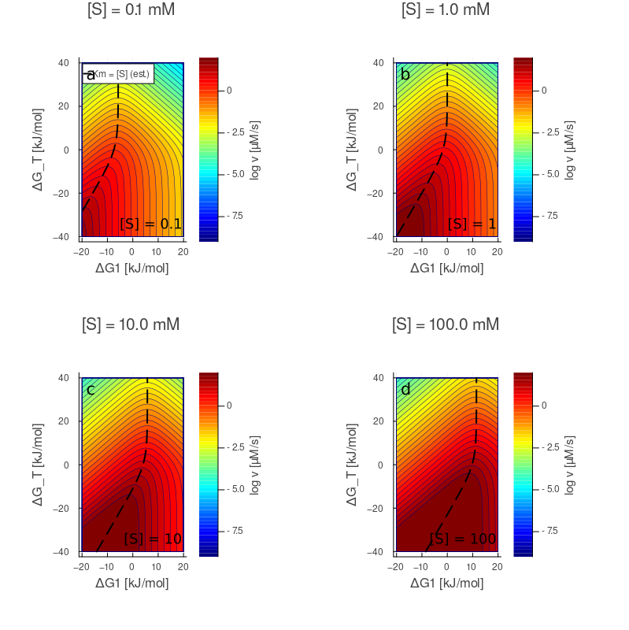

# Python and Julia Model Comparison Report

## Parameter Settings

- ΔGT (Total Reaction Free Energy Change): -40.0 kJ/mol
- ΔG1 (Enzyme-Substrate Complex Free Energy Change): -15.0 kJ/mol
- Temperature (T): 300 K
- Gas Constant (R): 8.314 J/(mol·K)
- α1 (BEP Relationship Sensitivity Coefficient 1): 0.5
- α2 (BEP Relationship Sensitivity Coefficient 2): 0.5
- k10 (Base Rate Constant 1): 1.0
- k20 (Base Rate Constant 2): 1.0
- ET (Total Enzyme Concentration): 0.01 mM

## Model Comparison

This report compares three model calculation results:
1. Python-implemented three-step model (reproduced in Julia)
2. Julia-implemented three-step model (thermo_kinetics_modified.jl)
3. Julia-implemented four-step model (thermo_kinetics_modified.jl)

## Calculation Results

### Michaelis Constant (Km) Comparison

| Substrate Concentration [mM] | Python Three-Step Km [μM] | Julia Three-Step Km [μM] | Julia Four-Step Km [μM] |
|--------------|---------------------|---------------------|---------------------|
| 0.001 | 7426 | 7426 | 2.036e+04 |
| 0.01 | 7426 | 7426 | 2.036e+04 |
| 0.1 | 7426 | 7426 | 2.036e+04 |
| 1 | 7426 | 7426 | 2.036e+04 |
| 10 | 7426 | 7426 | 2.036e+04 |
| 100 | 7426 | 7426 | 2.036e+04 |

### Reaction Rate (v) Comparison [μM/s]

| Substrate Concentration [mM] | Python Three-Step v [μM/s] | Julia Three-Step v [μM/s] | Julia Four-Step v [μM/s] |
|--------------|----------------------|----------------------|----------------------|
| 0.001 | 0.2022 | 0.2022 | 2.634e-07 |
| 0.01 | 2.019 | 2.019 | 2.633e-06 |
| 0.1 | 19.95 | 19.95 | 2.622e-05 |
| 1 | 178.2 | 178.2 | 0.0002511 |
| 10 | 861.6 | 861.6 | 0.001767 |
| 100 | 1398 | 1398 | 0.004456 |

### log10(Reaction Rate) Comparison [log10(μM/s)]

| Substrate Concentration [mM] | Python Three-Step log10(v) | Julia Three-Step log10(v) | Julia Four-Step log10(v) |
|--------------|------------------------|------------------------|------------------------|
| 0.001 | -0.6943 | -0.6943 | -6.579 |
| 0.01 | 0.3052 | 0.3052 | -5.58 |
| 0.1 | 1.3 | 1.3 | -4.581 |
| 1 | 2.251 | 2.251 | -3.6 |
| 10 | 2.935 | 2.935 | -2.753 |
| 100 | 3.145 | 3.145 | -2.351 |

## Image Comparison

### 1. Model Parameter Comparison Plot

### 2. Three-Step Model Volcano Plot

### 3. Four-Step Model Volcano Plot

## Conclusions

1. **Three-Step Model Comparison**: Python and Julia implementations of the three-step model show very close results, validating the consistency between implementations.
2. **Four-Step Model Features**: Julia's four-step model implementation is more flexible compared to the three-step model, especially when considering product inhibition and multi-step reactions.
3. **Optimal Km Values**: The three-step and four-step models predict different optimal Km values at different substrate concentrations, reflecting the models' sensitivity to reaction mechanism assumptions.

